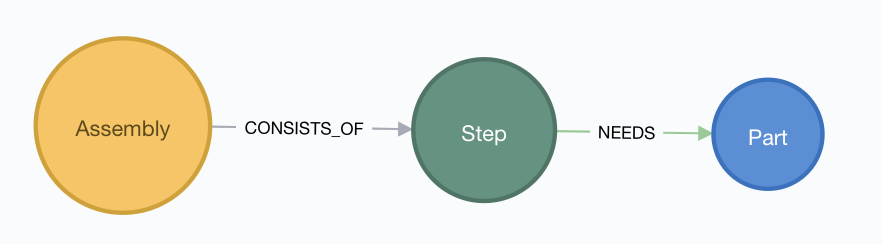

<!-- PROJECT LOGO -->
 

  

  <h3 align="center">T-47 Airspeeder</h3>

  

    T-47 LEGO assembly data and graph
     
     
    <!--a href="https://github.com/othneildrew/Best-README-Template"-->View Demo<!--/a-->
    ·
    <a href="https://github.com/jgoerner/t-47/issues">Report Bug</a>
    ·
    <a href="https://github.com/jgoerner/t-47/issues">Request Feature</a>
  

<!-- TABLE OF CONTENTS -->
## Table of Contents

* [About the Project](#about-the-project)
  * [Built With](#built-with)
* [Getting Started](#getting-started)
  * [Prerequisites](#prerequisites)
  * [Installation](#installation)
* [Usage](#usage)
* [Roadmap](#roadmap)
* [Contributing](#contributing)
* [License](#license)
* [Contact](#contact)
* [Acknowledgements](#acknowledgements)

<!-- ABOUT THE PROJECT -->
## About The Project

          

> "Are the speeders ready?" 
> "Not yet. We're having some trouble adapting them to the cold."  
> \- Han Solo and the Deck Officer

During the [battle of Hoth](https://starwars.fandom.com/wiki/Battle_of_Hoth/Legends) the [T-47 Airspeeder](https://starwars.fandom.com/wiki/T-47_airspeeder) have been key for the rebel allicance to handle Imperium's [most heavily armored ground vehicles](https://starwars.fandom.com/wiki/All_Terrain_Armored_Transport). 
Resounding thanks have gone to the brave pilots who lost their lives during the risky maneuvers. 
However, did anyone ever thanked the mechanics that build that "block of wood"?

Alright, enough Star Wars :-)

This repository contains data about the assembly process of the [LEGO T-47 Snowspeeder](https://www.brickowl.com/catalog/lego-rebel-snowspeeder-set-10129).
During the work of my master thesis on knowledge graphs and process mining, I had the need for real life open data.
Apparently I was not able to find free datasets about assemblies, interdependencies and parts - so I created this dataset.

This repository contains
- assembly data for the T-47 Snowspeeder
- an optional script to create a Neo4j graph from the data

### Built With
* [Neo4j](https://neo4j.com/)

<!-- GETTING STARTED -->
## Getting Started

You can use the dataset and process it with the tool of your choice.
The following steps describe you, how to ramp up the optional, build in graph.

### Prerequisites

The optional graph is incorporated as a Docker container, hence please [make sure to have Docker on your system](https://docs.docker.com/install/)

### Installation

1. Clone this repository
2. Run `./scripts/run-neo4j.sh`
3. Open your webbrowser on port `7474` and log in with `neo4j/test`

<!-- USAGE EXAMPLES -->
## Usage

If this is the first time you log into the graph run the following Cypher query: `CALL t47.init`

This procedure is part of [jgoerner/t-47-procedures](https://github.com/jgoerner/t-47-procedures) and constructs the graph from the csv file. 

The current schema incluces 3 Nodes, **Assembly**, **Step**, **Part**:

<!-- ROADMAP -->
## Roadmap

See the [open issues](https://github.com/jgoerner/t-47/issues) for a list of proposed features (and known issues).

<!-- CONTRIBUTING -->
## Contributing

Contributions are what make the open source community such an amazing place to be learn, inspire, and create. Any contributions you make are **greatly appreciated**.

1. Fork the Project
2. Create your Feature Branch (`git checkout -b feature/AmazingFeature`)
3. Commit your Changes (`git commit -m 'Add some AmazingFeature'`)
4. Push to the Branch (`git push origin feature/AmazingFeature`)
5. Open a Pull Request

<!-- LICENSE -->
## License

Distributed under the MIT License. See `LICENSE` for more information.

<!-- CONTACT -->
## Contact

Joshua Görner - [jgoerner](https://www.linkedin.com/in/jgoerner/) - joshua.goerner[at]gmail.com

<!-- ACKNOWLEDGEMENTS -->
## Acknowledgements
* The LEGO Group - THE toy of my childhood (and hopefully the one of my child's too :-))
* [F. Schönteich, A. Kasten, A. Scherp](https://www.researchgate.net/publication/327427296_A_Pattern-Based_Core_Ontology_for_Product_Lifecycle_Management_based_on_DUL) - initial inspiration to link manufacturing and LEGO datasets
* [O. Drew](https://github.com/othneildrew/Best-README-Template) - nice GH Readme template
